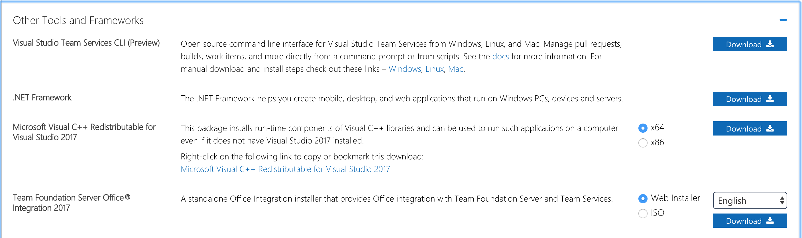
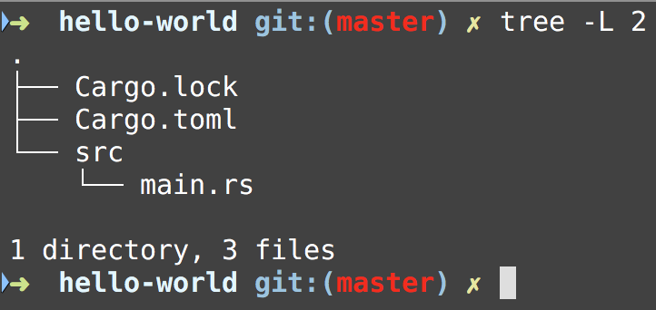
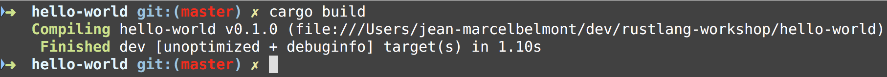
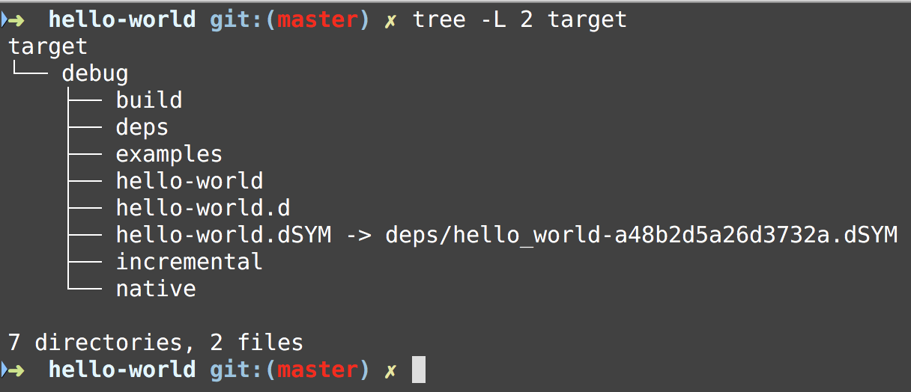

# Rust Workshop

* [Hello World](docs/hello_world.md)
* [Variables](docs/variables.md)
* [Control Flow](docs/control_flow.md)
* [Functions](docs/functions.md)
* [Data Types](docs/data_types.md)
* [Comments](docs/comments.md)
* [Ownership](docs/ownership.md)
* [References](docs/references.md)
* [Borrowing](docs/borrowing.md)
    * [Slices](docs/slices.md)
* [Structs](docs/structs.md)
    * [Methods](docs/methods.md)
* [Enums](docs/enums.md)
* [Pattern Matching](docs/pattern_matching.md)
* [Modules](docs/modules.md)
* [Common Data Structures](docs/common_data_structures.md)
    * [Vectors](docs/vectors.md)
    * [Strings](docs/strings.md)
    * [Hash Maps](docs/hash_maps.md)
* [Error Handling](docs/error_handling.md)
* [Generic Types](docs/generic_types.md)
* [Traits](docs/traits.md)
* [Lifetimes](docs/lifetimes.md)
* [Testing](docs/testing.md)
* [Helpful Crates](docs/helpful-crates.md)

## Installing Rust

To install Rust in Linux and Mac OS X run the following command:

```bash
curl https://sh.rustup.rs -sSf | sh
```

For other installation methods please read the following [documentation](https://www.rust-lang.org/en-US/other-installers.html)

Add the cargo binaries to your path by adding the following entry in *~/.profile*, *~/.bash_profile*:

```bash
export PATH="$HOME/.cargo/bin:$PATH"
```

#### Installing Rust in Windows

On Windows, go to [install](https://www.rust-lang.org/install.html) and follow the instructions for installing Rust. 

You will need to install C++ build tools for Visual Studio 2013 or later here but it is best to just install [Visual Studio Build Tools](https://visualstudio.microsoft.com/downloads/#build-tools-for-visual-studio-2017)

The tools are in the Other Tools and Frameworks section which looks like this:



#### Check Rust Installation

If Rust is installed then you should be able to run the following command in your terminal windows:

```bash
rustc --version
rustc 1.26.2 (594fb253c 2018-06-01)
```

## Updating Rustlang

In order to update the rust binaries you need to run the following command:

```bash
rustup update
```

Now when we run the `--version` options with rustc a new version should be reported if the update found a new version:

```bash
rustc --version
rustc 1.28.0 (9634041f0 2018-07-30)
```

## Viewing Local Documentation

In order to see local documentation you can run the following command:

```bash
rustup doc
```

## Cargo Package Manager

Rust comes with a powerful package manager called **cargo**.

You can create new rust packages by using the cargo package manager.

The command you use is: `cargo new` with options and provide a name

#### Create a new binary template package

If you want to create a new rust binary template application then run the following command:

```bash
cargo new PACKAGE_NAME --bin
```

#### Create a new library template package

If you want to create a new rust library template application then run the following command:

```bash
cargo new PACKAGE_NAME --lib
```

#### The contents of a new binary template package

When you create a new binary application cargo will create the following files:



Notice that the following files were created:

* Cargo.lock
    * This file locks your dependencies
* Cargo.toml
    * This file will have basic metadata for the rust package and dependencies
* src directory
    * main.rs
        * This will be main program for the application

Contents of *Cargo.toml*:

```toml
[package]
name = "hello-world"
version = "0.1.0"
authors = ["Jean-Marcel Belmont <marcelbelmont@gmail.com>"]

[dependencies]
```

Contents of *src/main.rs*:

```rust
fn main() {
    println!("Hello, world!");
}
```

#### Build Rust package

In order to build the rust package you can run the following command:



This command generates the *target* directory with the following content:



#### Running Rust package

You could run rust packages by issuing the following command:

```bash
cargo run
```

This will build and run the rust package.

#### Check the Rust package for build issues

You can use the `cargo check` command to see if your package will build but it will not create an executable.

#### Running individual cargo packages

You can run individual *cargo* packages like this:

```bash
cargo run -p strings
```

This will run the strings cargo package only

You should probably try to run `cargo build` before doing this in your system.

#### Running individual tests with cargo

You can run individual *cargo* tests in a particular package by doing the following:

```bash
cargo test -p testing
```

This will only run tests in the testing cargo package.
