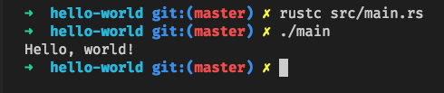
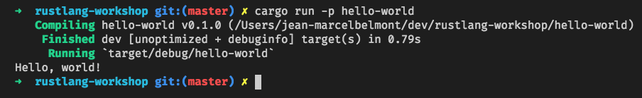
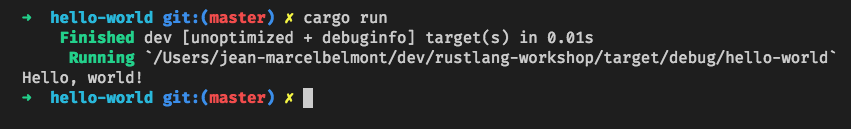

# Rust Workshop - Hello World

## Sections:

* [Customary Hello World Program](#customary-hello-world-program)
* [Bread Crumb Navigation](#bread-crumb-navigation)

## Customary Hello World Program 

Showing the hello world program source file:

```rust
// A comment is here now

// You need a main function to run 
fn main() {
    println!("Hello Rustlang Workshoppers!");
}
```

#### Rust Playground link to play with

[Helloworld Playground Link](https://play.rust-lang.org/?version=stable&mode=debug&edition=2018&gist=b5dc655af9092c59234c1179477f7e93)

#### Compiling source code to play with locally using rustc



Notice that we directly used the rustc compiler that comes installed with cargo.

#### Running example with cargo package option



Notice that here we passed a flag to cargo of `-p`, which is Package with the target to run option

#### Running example with cargo inside package



Here we just ran with `cargo run` since we were already in the *hello-world* package already

#### Running with target binary executable

```bash
> ./target/debug/hello-world
Hello, world!
```

## Bread Crumb Navigation
_________________________

Previous | Next
:------- | ---:
← [README](../README.md) | [Variables](./variables.md) →
