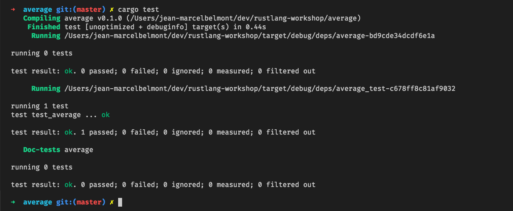
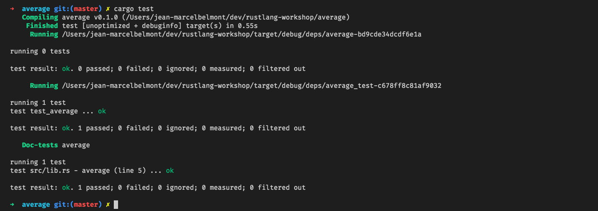
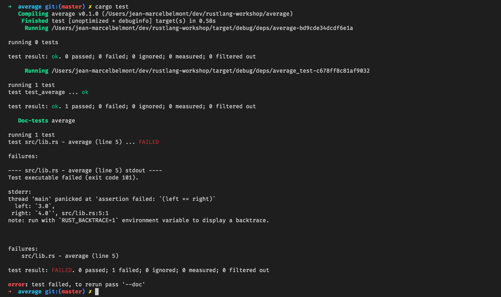
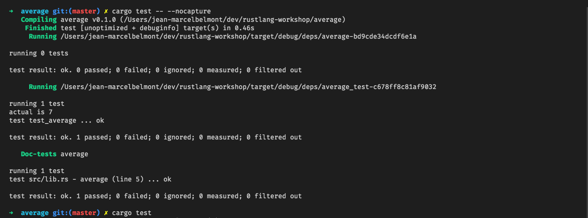
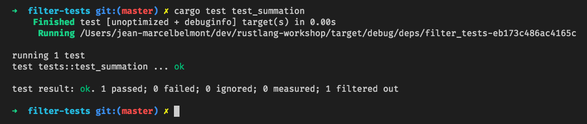
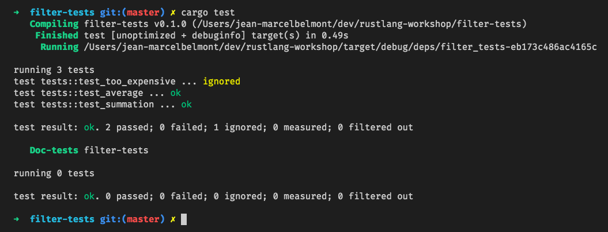

# Rust Workshop - Testing

## Sections:

* [Software Testing Concept](#software-testing-concept)
* [Unit Tests](#unit-tests)
    * [Unit Test Example](#unit-test-example)
* [Integration Tests](#integration-tests)
* [Documentation Tests](#documentation-tests)
* [Showing Test Output](#showing-test-output)
* [Filtering Tests by Name](#filtering-test)
* [Ignoring Tests](#ignoring-tests)
* [Miscellaneous Testing Topics](#miscellaneous-testing-topics)
    * [Mocks and Stubs](#mocks-and-stubs)
    * [Test Fixtures](#test-fixtures)
    * [Property Based Testing](#property-based-testing)
    * [TDD](#tdd)
    * [BDD](#bdd)
* [How to Find Me](#how-to-find-me)
* [Bread Crumb Navigation](#bread-crumb-navigation)

## Software Testing Concept

Testing can help uncover possible bugs :bug: in your source code but will not necessarily prove correctness in your code.

There are many types of testing that you can do and I wrote a workshop on it that you can explore [here](https://github.com/jbelmont/software-testing-workshop)

## Unit Tests

A unit tests will generally tests a unit of code such as a function or a series of functions.

Unit tests are usually automated tests that test a unit of work such that it is behaving as intended.

Testing is integrated in Rust so we can use easily unit test our source code.

Unit tests in Rust are usually Rust functions that test the behavior of the code.

We have been making assertions of our source code throughout the workshop but have not formally talked about testing up until now.

When you are writing unit tests in Rust you will typically place them in a module called `tests` and use the following attributes:

* [#[cfg(test)]](https://doc.rust-lang.org/std/macro.cfg.html)
* [#[test]](https://doc.rust-lang.org/reference/attributes/testing.html)

*In your unit tests you will usually make function/method calls for the unit under test.*

You can use the following macros that exist in the Rust Standard Library for your unit tests:

* [assert!](https://doc.rust-lang.org/std/macro.assert.html)
    *  Asserts that a boolean expression is true at runtime.

* [assert_eq!](https://doc.rust-lang.org/std/macro.assert_eq.html)
    * Asserts that two expressions are equal to each other.

* [assert_ne!](https://doc.rust-lang.org/std/macro.assert_ne.html)
    * Asserts that two expressions are not equal to each other.

If a particular unit test fails then you will receive a runtime panic.

#### Unit Test Example

Let us look at a Unit Test example to further solidify the concept:

```rust
#[allow(dead_code)]
fn average(numbers: Vec<i32>) -> f32 {
    let mut sum: i32 = 0;
    for n in numbers.iter() {
        sum += n;
    }
    (sum / numbers.len() as i32) as f32
}

#[cfg(test)]
mod tests {
    use super::average;
    
    #[test]
    fn test_average() {
        let actual = average(vec![1, 2, 3, 4, 5]);
        assert_eq!(actual, 3.0);
    }
}

...........................................................................

running 1 test
test tests::test_average ... ok

test result: ok. 1 passed; 0 failed; 0 ignored; 0 measured; 0 filtered out


running 0 tests

test result: ok. 0 passed; 0 failed; 0 ignored; 0 measured; 0 filtered out
```

[Unit Test Playground](https://play.rust-lang.org/?version=stable&mode=debug&edition=2018&gist=53acd5b013a53e6d0c1c1b902f27f8ea)

## Integration Tests

An integration tests is typically used to test a group of functionality and you will typically write an integration test after a unit test, although this is not a hard and fast either.

Additionally integration tests help test your public api and wouldn't test any private code you have.

An integration test will test that your code works correctly as a cohesive unit.

One thing of note is that you cannot group your integration tests in the same location as your unit tests.

The [cargo](https://doc.rust-lang.org/cargo/index.html) package manager in Rust expects that your integration tests live in a folder called `tests` that is next to your `src` directory.

Let us say that our average function lived in [average/src/lib.rs](../average/src/lib.rs) in a crate called `average` like this:

```rust
fn average(numbers: Vec<i32>) -> f32 {
    let mut sum: i32 = 0;
    for n in numbers.iter() {
        sum += n;
    }
    (sum / numbers.len() as i32) as f32
}
```

We will place our integration tests in a folder called `tests` next to the `src` folder inside of the average crate.

Our integration test for the average public api would look like this:

```rust
extern crate average;

#[test]
fn test_average() {
    let actual = average::average(vec![5, 6, 7, 8, 9, 10]);
    assert_eq!(actual, 7.0);
}
```

Notice here that we explicitly declare `extern crate average` since our integration test does not about this function.



Admittedly this is not a very useful integration tests, this is mainly to demonstrate how you would setup and run an integration test.

A more useful example of an integration test could be testing a restful api endpoint.

Using your integration test you could test that the route handler function is called and that any service functions related to this route are called.

So in this way you can test the behavior of groups of functions/methods by utilizing integration tests in Rust.

## Documentation Tests

Rust provides an additional type of test called Documentation Tests.

In rust, the primary way of documenting a rust code base is through documentation comments.

You can also execute documentation tests using `cargo test` command.

Let us write a documentation test for our `average` function:

```rust
/// This function computes an average for a 
// vector of i32 data types.
///
/// # Examples
/// 
/// ```rust
/// let result = average::average(vec![1,2,3,4,5]);
/// assert_eq!(result, 3.0);
/// ```
#[allow(dead_code)]
pub fn average(numbers: Vec<i32>) -> f32 {
    let mut sum: i32 = 0;
    for n in numbers.iter() {
        sum += n;
    }
    (sum / numbers.len() as i32) as f32
}
```



Notice here that our `cargo test` run included line `Doc-tests` now.

We can also confirm that the document tests are running by making the doc test fail:

If we change our assertion to `assert_eq!(result, 4.0);`.

document test fail:



The main goal around documentation tests is to provide examples that show the behavior of the code.

Rust strives to allow examples from documents to perform as complete code snippets.

Please read more this in the [api guidelines book](https://rust-lang.github.io/api-guidelines/documentation.html#examples-use--not-try-not-unwrap-c-question-mark)

## Showing Test Output

The default behavior for the Rest test library is to captur anything that is printed to standard output.

This means that you won't be able to print any output to the screen unless your test fails.

We can utilize a command line argument to disable this behavior like this:

```bash
cargo test -- --nocapture
```

So if we updated our integration test example like this:

```rust
#[test]
fn test_average() {
    let actual = average::average(vec![5, 6, 7, 8, 9, 10]);
    println!("actual is {}", actual);
    assert_eq!(actual, 7.0);
}
```

By using the `--nocapture` flag we would be able to see standard output in the screen:



## Filtering Tests by Name

By Default when you run `cargo test` it will run any tests that it sees.

In order to filter out and run a single test you can pass the name of the unit test to run.

Let us say that we have the following crate called `filter-tests`:

```rust
#[allow(dead_code)]
fn average(numbers: Vec<i32>) -> f32 {
    let mut sum: i32 = 0;
    for n in numbers.iter() {
        sum += n;
    }
    (sum / numbers.len() as i32) as f32
}

#[allow(dead_code)]
fn summation(numbers: Vec<i32>) -> i32 {
    let mut sum: i32 = 0;
    for n in numbers.iter() {
        sum += n;
    }
    sum
}

#[cfg(test)]
mod tests {
    use super::*;

    #[test]
    fn test_average() {
        let actual = average(vec![5, 6, 7, 8, 9, 10]);
        assert_eq!(actual, 7.0);
    }

    #[test]
    fn test_summation() {
        let actual = summation(vec![1, 2, 3, 4, 5]);
        assert_eq!(actual, 15);
    }
}
```

Notice that here we have 2 unit tests, one that tests the average function and another that tests the summation function.

If we wanted to just run the `test_summation` unit test we could do the following:

```bash
cargo test test_summation
```



## Ignoring Tests

You can also ignore tests by using the `#[ignore]` attribute



Notice that `cargo` reported that a test was ignored in *yellow*

## Miscellaneous Testing Topics

There is a multitude of testing subjects besides what I have covered here.

One great resource for general software testing is [Martin Fowlers Testing Guide](https://martinfowler.com/testing/)

You won't find any rust specific code whereas testing guidelines and concepts that can apply to any programming language.

#### Mocks and Stubs

I don't have any specific advice on Mocks and Stubs to show as I still figuring it out.

One idea I have read through reddit posts is to use `trait objects` to facilitate generating test stubs with Rust.

#### Test Fixtures

You can read this article on [test fixtures](https://internals.rust-lang.org/t/pre-rfc-lightweight-test-fixtures/6605/12)

#### Property Based Testing

I actually wrote a little bit about Property based testing in the Papers We Love RDU Chapter that you can check out [Here](http://paperswelove.org/raleigh-durham/docs/quickcheck/quickcheck.html)

Please checkout this [Wikipedia Link for more information](https://en.wikipedia.org/wiki/QuickCheck)

#### TDD

I would suggest reading Kent Becks book on Test-Driven Development for the best insight which you can find on amazon [here](https://www.amazon.com/gp/product/0321146530?ie=UTF8&tag=martinfowlerc-20&linkCode=as2&camp=1789&creative=9325&creativeASIN=0321146530)

I also did my humble attempt on explaining TDD on my [software testing workshop](https://www.marcelbelmont.com/software-testing-workshop/docs/tdd/tdd.html)

The examples are written in JavaScript but the one idea is the same.

#### BDD

The cucumber documentation has one of the best overall explanation about Behavior-Driven Development (BDD) IMHO.

[Cucumber Docs](https://cucumber.io/docs/guides/overview/)

## How to Find me

If you like this free book on Rust then please consider following me on the following social media outlets:

#### Twitter & Github Account

Please follow me at [jbelmont @ github](https://github.com/jbelmont) and [jbelmont80 @ twitter](https://twitter.com/jbelmont80)

## Bread Crumb Navigation
_________________________

Previous | Next
:------- | ---:
← [Lifetimes](./lifetimes.md) | [README](../README.md) →
